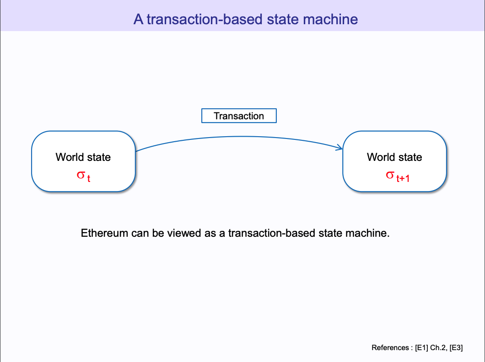
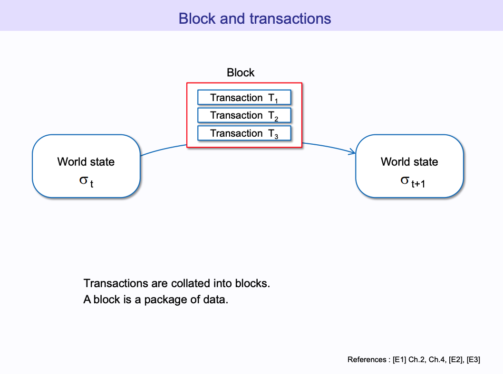
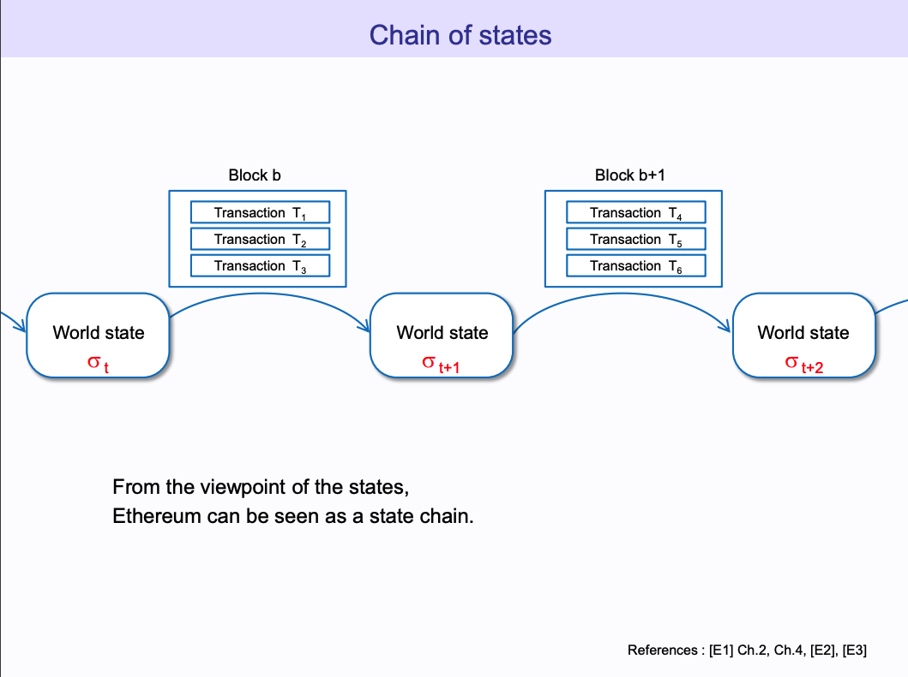
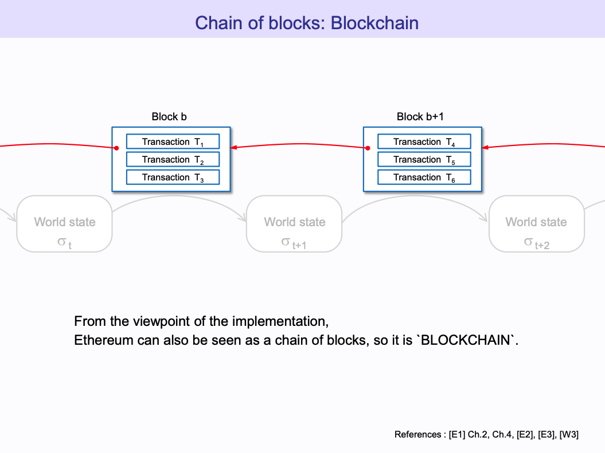
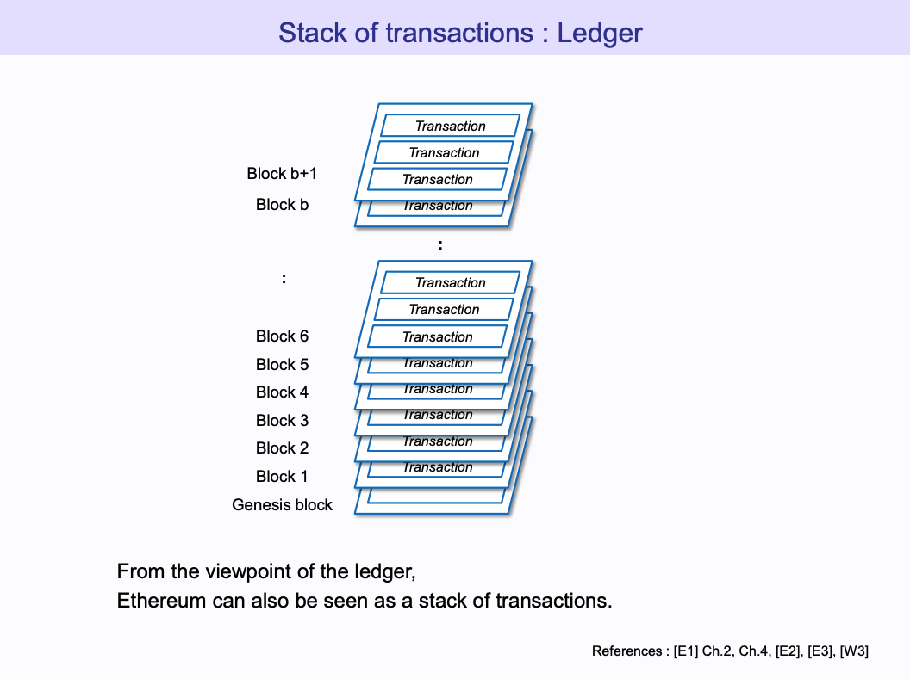
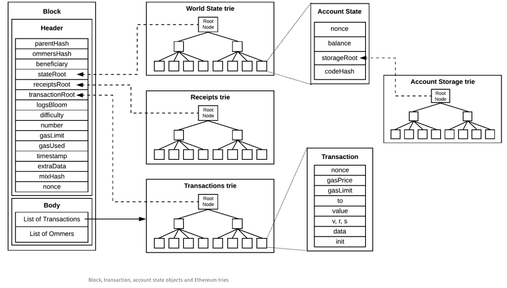
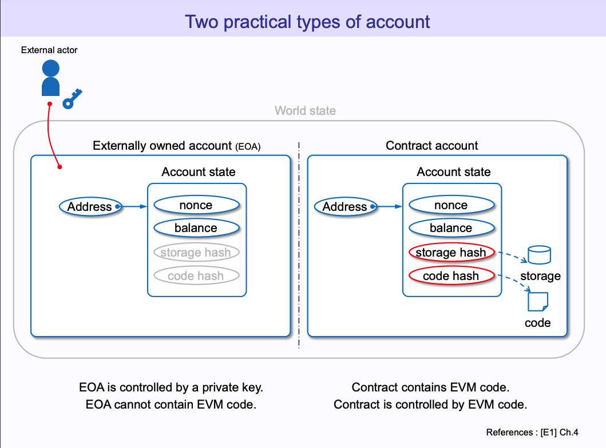

Mathematical definition of the `Ethereum Computer σt + 1 ≡ Υ(σt,T) => (1)`

Where,
    
- σt+1 is the next world state
- Υ is the Ethereum state transition function
- σt is the current world state
- T is the transaction



The equation `B ≡ (...,(T0, T1, ...), ...) => (2)` represents a block as a list of transactions.

The equation `σt + 1 ≡ Π (σt, B) => (3)` represents the shift in the world state after applying a Block B of transactions `eq. (2)`

Where,

- σt+1 is the next world state
- Π is the block-level state transition function
- σt is the current world state
- B is a block (list of some transactions)

The equation `Π(σ, B) ≡ Ω(B, Υ(Υ(σ, T0), T1)...) => (4)` gives more details about the block level state transition function `Π`. The state transition function `Y` calculates `σ0 = Y(σ, T0), σ1 = Y(σ0, T1),... σn = Y(σn-1, Tn)` which are then added into the block `B`. Once this is done the `block-level-state-transition function Π kicks in` and then `Ω` which finalizes the block and pays the miner and uncles the intended reward amount for spending the time and energy to produce a block.






# Ethereum World State



- In Ethereum everything is represented/stored via Merkle Patricia Trie. MPTs are a modified version of Merkle Trees.
- Accounts:
    
    - In Ethereum there are 2 types of accounts `External Owned Accounts (EOA) that have an associated private key, which you and me have & Smart Contract Account (the address that we get after code deployment)`
    - External Owned Account:

        - Have an associated private key, is used via MetaMask, TrustWallet, Coinbase etc

    - Smart Contract Account:

        - The address we get once we deploy the contract forms the smart contract account.

    - Theoretically this sounds good, however, how does Ethereum at the low-level identify the different types of accounts? Let us try to answer this question

        - Imagine an account in Ethereum as a JSON object containing `nonce`, `balance`, `storageRoot` & `codeHash` as the keys.
        - ```javascript
            {
                nonce: 0,
                balance: 1.5,
                storageRoot: '0x123456789...',
                codeHash: '0x60684058974563258954744155dfsafsdfsda545589896633115445447dfwerwe...'
            }
        - For an EOA, `storageRoot & codeHash` is empty i.e. `codeHash = keccak256('') & storageRoot: '0x'`
        - For a Contract Account, `storageRoot` is the root hash of the `Account Storage Trie` & `codeHash` is the `deployed bytecode` which is immutable, thus, contract once deployed cannot be updated.



- Transaction

    - A transaction in Ethereum can only be invoked by an `EOA`, remember the world state changes by means of transactions i.e. from in order to move from `σt to σt+1 there must be a T`.
    - As with the accounts, the transaction objects contains the following, keys:
    - ```javascript
        {
            nonce: 'For EOA: No. of sent transactions, For Contract Account: No. of smart contracts created',
            gasPrice: 'The amount for each unit of gas that you are willing to spend',
            gasLimit: 'The maximum amount of gas that will be used for transaction execution',
            to: 'The address to whom the transaction is intended, to is the recipient',
            value: 'If the transaction intends to transfer Ether, this field is non-zero, else it is zero',
            v,r,s: 'The ECDSA signature components',
            data: 'This is empty in case of value transfer else it contains the bytecode that has to be executed',
            init: 'An unlimited size byte array specifying the EVM-code for the account initialisation procedure'
        }
References:
1. https://ethereum.github.io/yellowpaper/paper.pdf
2. https://www.lucassaldanha.com/ethereum-yellow-paper-walkthrough-1/
3. https://takenobu-hs.github.io/downloads/ethereum_evm_illustrated.pdf
